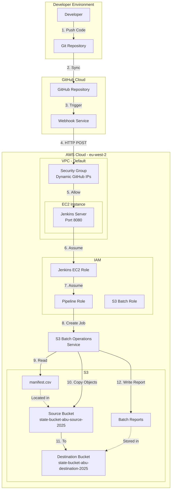
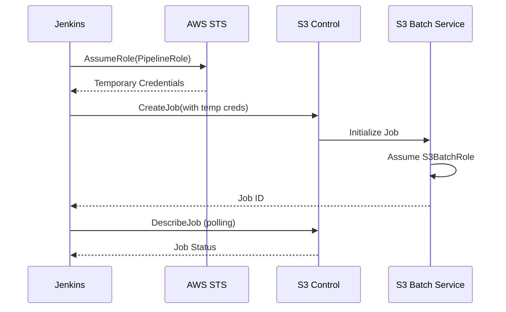
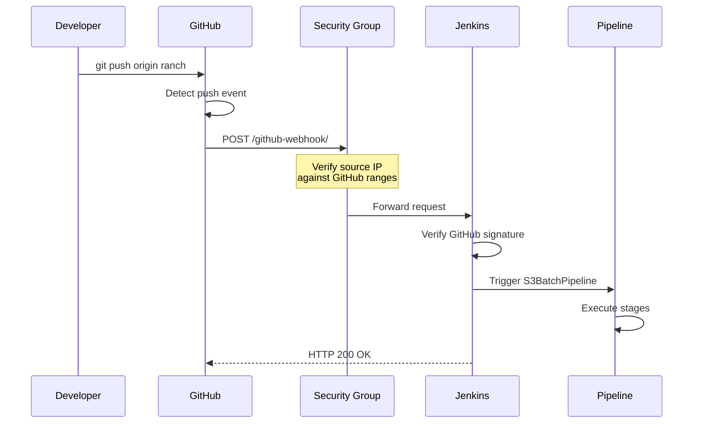
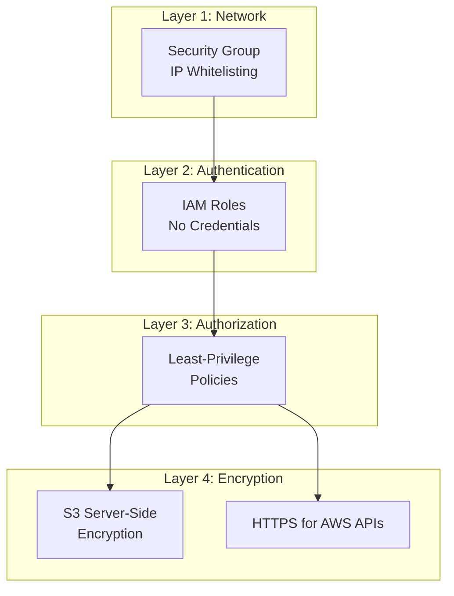
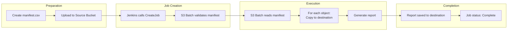

# Architecture Documentation

## 📐 System Architecture Overview

This document provides a detailed technical overview of the S3 Batch Operations Pipeline architecture, including component interactions, data flows, and design decisions.

---

## 🏗️ High-Level Architecture



---

## 🔧 Component Details

### 1. **Infrastructure Layer (Terraform)**

#### **EC2 Module** (`modules/ec2/`)
**Purpose**: Provisions Jenkins server with secure network configuration and persistent data storage

**Resources**:
- `aws_instance.jenkins`: Ubuntu 22.04 EC2 instance (t3.micro)
- `aws_ebs_volume.jenkins_data`: 20GB encrypted gp3 volume for `/var/lib/jenkins`
- `aws_volume_attachment.jenkins_data`: Attaches EBS volume to EC2
- `aws_security_group.jenkins_sg`: Dynamic security group with GitHub IP whitelisting
- `aws_iam_instance_profile.jenkins_profile`: IAM profile for Jenkins EC2
- `aws_dlm_lifecycle_policy.jenkins_backup`: Automated daily snapshots

**Key Features**:
- **Stateless EC2 Pattern**: Jenkins data on separate EBS volume survives instance replacement
- **Automated Backups**: Daily snapshots at 3 AM UTC, 7-day retention
- **Dynamic GitHub IP Whitelisting**: Fetches current GitHub webhook IPs via HTTP API
- **User Data Bootstrap**: Formats/mounts EBS volume, installs Python, Ansible, Git
- **Public IP Association**: Enables external access for webhooks

**Security Group Rules**:
```hcl
# Ingress
Port 22   (SSH)    → User IP only
Port 8080 (Jenkins)→ User IP + GitHub IPs (4 CIDR ranges)
Port 80   (HTTP)   → User IP only
Port 443  (HTTPS)  → User IP only
ICMP      (Ping)   → User IP only

# Egress (Explicit)
Port 443  (HTTPS)  → 0.0.0.0/0 (AWS APIs, package updates)
Port 80   (HTTP)   → 0.0.0.0/0 (package updates)
Port 53   (DNS)    → 0.0.0.0/0 (UDP and TCP)
Port 123  (NTP)    → 0.0.0.0/0 (time sync)
```

#### **IAM Module** (`modules/iam/`)
**Purpose**: Implements least-privilege access control

**Roles**:

1. **Jenkins EC2 Role** (`prod-JenkinsEC2Role`)
   - Attached to EC2 instance
   - Can assume Pipeline Role
   - Minimal permissions (STS only)

2. **Pipeline Role** (`prod-PipelineRole`)
   - Assumed by Jenkins during builds
   - Can create/describe S3 Batch jobs
   - Can read source bucket, write to destination
   - Can pass S3 Batch Role to batch service

3. **S3 Batch Operations Role** (`prod-S3BatchOperationsRole`)
   - Used by S3 Batch service
   - Can read from source bucket
   - Can write to destination bucket
   - Can generate reports

**Trust Relationships**:
```
Jenkins EC2 Role
    ↓ (can assume)
Pipeline Role
    ↓ (can pass to)
S3 Batch Operations Role
```

#### **S3 Module** (`modules/s3/`)
**Purpose**: Provides object storage for batch operations

**Buckets**:
- **Source Bucket**: Contains objects to be processed + manifest file
- **Destination Bucket**: Receives copied objects + batch reports

**Features**:
- Versioning enabled on both buckets
- Server-side encryption (AES256)
- Lifecycle policies (optional, not implemented)

---

### 2. **Configuration Layer (Ansible)**

#### **Playbook Structure**
```
ansible/
├── playbooks/
│   ├── jenkins.yml              # Main playbook
│   └── group_vars/
│       └── all.yml              # Jenkins configuration
├── inventories/
│   └── prod/
│       └── hosts.ini            # EC2 instance details
└── roles/
    └── geerlingguy.jenkins/     # External role
```

#### **Configuration Flow**
1. **Pre-tasks**: Update apt cache, install Java 17, AWS CLI v2
2. **Jenkins Role**: Install Jenkins LTS, configure ports, disable setup wizard
3. **Plugin Installation**: Install required plugins (git, github, aws-credentials, etc.)
4. **Service Management**: Ensure Jenkins is running and enabled

#### **Key Configurations**
```yaml
jenkins_http_port: 8080
jenkins_admin_username: admin
jenkins_java_options: "-Djenkins.install.runSetupWizard=false"
jenkins_plugins:
  - git
  - github
  - pipeline-model-definition
  - workflow-aggregator
  - credentials-binding
  - aws-credentials
  - blueocean
  - ssh-agent
```

---

### 3. **Pipeline Layer (Jenkins)**

#### **Jenkinsfile Structure**
```groovy
pipeline {
    agent any
    
    environment {
        AWS_REGION = 'eu-west-2'
    }
    
    triggers {
        githubPush()  // Auto-trigger on push
    }
    
    parameters {
        // Bucket names, account ID, role ARNs
    }
    
    stages {
        stage('Assume Pipeline Role') {
            // Get temporary credentials via STS
        }
        
        stage('Create S3 Batch Job') {
            // Submit batch operation
        }
        
        stage('Monitor Batch Job') {
            // Poll until complete
        }
    }
    
    post {
        always {
            // Cleanup credentials
        }
    }
}
```

#### **Credential Flow**


---

### 4. **Automation Layer (GitHub Webhooks)**

#### **Webhook Flow**


#### **Webhook Security**
1. **IP Whitelisting**: Only GitHub's official IP ranges allowed
2. **Dynamic Updates**: Terraform fetches current IPs on each apply
3. **HTTPS Not Required**: Internal webhook (not exposed to internet)
4. **No Authentication**: Relies on IP whitelisting + GitHub signatures

---

## 🔐 Security Architecture

### **Defense in Depth**



### **Principle of Least Privilege**

Each role has only the minimum permissions required:

**Jenkins EC2 Role**:
```json
{
  "Effect": "Allow",
  "Action": "sts:AssumeRole",
  "Resource": "arn:aws:iam::*:role/prod-PipelineRole"
}
```

**Pipeline Role**:
```json
{
  "Effect": "Allow",
  "Action": [
    "s3control:CreateJob",
    "s3control:DescribeJob",
    "s3:GetObject",
    "s3:PutObject",
    "iam:PassRole"
  ],
  "Resource": [
    "arn:aws:s3:::state-bucket-abu-source-2025/*",
    "arn:aws:s3:::state-bucket-abu-destination-2025/*",
    "arn:aws:iam::*:role/prod-S3BatchOperationsRole"
  ]
}
```

**S3 Batch Role**:
```json
{
  "Effect": "Allow",
  "Action": [
    "s3:GetObject",
    "s3:PutObject",
    "s3:PutObjectAcl"
  ],
  "Resource": [
    "arn:aws:s3:::state-bucket-abu-source-2025/*",
    "arn:aws:s3:::state-bucket-abu-destination-2025/*"
  ]
}
```

---

## 📊 Data Flow

### **S3 Batch Operations Workflow**



### **Manifest File Format**
```csv
state-bucket-abu-source-2025,test-file-1.txt
state-bucket-abu-source-2025,test-file-2.txt
```

### **Report File Format**
```csv
Bucket,Key,VersionId,TaskStatus,ErrorCode,HTTPStatusCode
state-bucket-abu-source-2025,test-file-1.txt,,succeeded,,,200
state-bucket-abu-source-2025,test-file-2.txt,,succeeded,,,200
```

---

## 🔄 State Management

### **Terraform State**
- **Backend**: Local (can be migrated to S3 + DynamoDB)
- **State Locking**: Not implemented (single operator)
- **Sensitive Data**: Marked with `sensitive = true`

### **Ansible Idempotency**
All tasks are idempotent and can be safely re-run:
- Package installations check if already installed
- Configuration files use templates with checksums
- Services are restarted only when config changes

---

## 🚀 Scalability Considerations

### **Current Limitations**
- Single Jenkins server (no HA)
- Manual credential rotation
- Local Terraform state
- No auto-scaling

### **Future Enhancements**
1. **High Availability**:
   - Jenkins master-agent architecture
   - Auto-scaling group for Jenkins agents
   - Load balancer for webhook distribution

2. **State Management**:
   - Terraform remote state in S3
   - DynamoDB for state locking
   - Separate state per environment

3. **Monitoring**:
   - CloudWatch metrics for S3 Batch jobs
   - Jenkins build metrics
   - Security group change alerts

4. **Disaster Recovery**:
   - Automated backups of Jenkins configuration
   - Cross-region S3 replication
   - Infrastructure versioning

---

## 📈 Performance Characteristics

### **S3 Batch Operations**
- **Throughput**: Up to 5,000 objects/second
- **Concurrency**: Automatically managed by AWS
- **Retry Logic**: Built-in with exponential backoff

### **Jenkins Pipeline**
- **Build Time**: ~2-3 minutes for typical job
- **Polling Interval**: 30 seconds for job status
- **Timeout**: 30 minutes max per stage

### **Network**
- **Webhook Latency**: <1 second (GitHub → Jenkins)
- **API Calls**: All within same region (eu-west-2)
- **Bandwidth**: Limited by EC2 instance type (t2.micro)

---

## 🔍 Monitoring & Observability

### **Key Metrics**

**Infrastructure**:
- EC2 CPU/Memory utilization
- Network in/out
- Disk usage

**Application**:
- Jenkins build success rate
- S3 Batch job completion time
- Webhook delivery success rate

**Security**:
- Failed SSH attempts
- Unauthorized API calls
- Security group changes

### **Logging Strategy**

**Jenkins Logs**:
- Location: `/var/log/jenkins/jenkins.log`
- Rotation: Daily
- Retention: 7 days

**S3 Batch Reports**:
- Location: `s3://state-bucket-abu-destination-2025/reports/`
- Format: CSV
- Retention: Indefinite

**CloudTrail** (Recommended):
- All API calls logged
- S3 bucket for long-term storage
- Athena for querying

---

## 🎯 Design Decisions

### **Why Terraform?**
- Declarative infrastructure definition
- State management for drift detection
- Modular architecture for reusability
- Wide AWS provider support

### **Why Ansible?**
- Agentless (SSH-based)
- Idempotent by design
- Large community (geerlingguy roles)
- Simple YAML syntax

### **Why Jenkins?**
- Industry standard for CI/CD
- Extensive plugin ecosystem
- Pipeline-as-code (Jenkinsfile)
- Easy GitHub integration

### **Why S3 Batch Operations?**
- Serverless (no infrastructure to manage)
- Scalable (handles billions of objects)
- Cost-effective (pay per job)
- Built-in retry and reporting

---

## 📚 References

- [AWS S3 Batch Operations Best Practices](https://docs.aws.amazon.com/AmazonS3/latest/userguide/batch-ops-basics.html)
- [Terraform AWS Provider Documentation](https://registry.terraform.io/providers/hashicorp/aws/latest/docs)
- [Ansible Best Practices](https://docs.ansible.com/ansible/latest/user_guide/playbooks_best_practices.html)
- [Jenkins Pipeline Syntax Reference](https://www.jenkins.io/doc/book/pipeline/syntax/)
- [GitHub Webhook Events](https://docs.github.com/en/developers/webhooks-and-events/webhooks/webhook-events-and-payloads)

---

**Document Version**: 1.0  
**Last Updated**: 2026-01-01  
**Maintained By**: TripleAze
