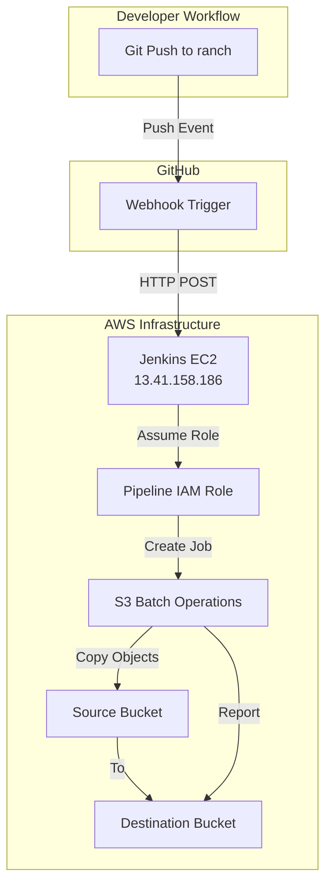

# S3 Batch Operations Pipeline

[](https://www.terraform.io/)
[](https://www.ansible.com/)
[](https://www.jenkins.io/)
[](https://aws.amazon.com/)

A production-ready, fully automated S3 Batch Operations pipeline orchestrated by Jenkins, provisioned with Terraform, and configured with Ansible. Features secure GitHub webhook integration with dynamic IP whitelisting.

---

## 🎯 Project Overview

This project automates large-scale S3 object operations using AWS S3 Batch Operations, triggered automatically via GitHub webhooks. It demonstrates infrastructure-as-code best practices, least-privilege security, and end-to-end automation.

### **Key Features**
- 🚀 **Fully Automated**: Push to GitHub → Webhook → Jenkins → S3 Batch Job
- 🔒 **Secure by Default**: Dynamic GitHub IP whitelisting, least-privilege IAM roles
- 📦 **Infrastructure as Code**: Complete Terraform modules for reproducible deployments
- 🔧 **Automated Configuration**: Ansible playbooks for consistent server setup
- 📊 **Production Ready**: Comprehensive error handling, monitoring, and reporting

---

## 🏗️ Architecture



---

## 📁 Project Structure

```
s3-batch-pipeline/
├── modules/
│   ├── ec2/          # Jenkins server with dynamic GitHub IP whitelisting
│   ├── iam/          # Least-privilege roles (Jenkins, Pipeline, S3 Batch)
│   └── s3/           # Source and destination buckets
├── ansible/
│   ├── playbooks/    # Jenkins installation and configuration
│   └── roles/        # geerlingguy.jenkins role
├── envs/
│   └── prod.tfvars   # Production environment variables
├── scripts/
│   └── upload_test_data.sh  # Test data upload script
├── Jenkinsfile       # Pipeline definition
└── manifest.csv      # S3 Batch Operations manifest
```

---

## 🚀 Quick Start

### **Prerequisites**
- AWS Account with appropriate permissions
- Terraform >= 1.0
- Ansible >= 2.9
- SSH key pair for EC2 access
- GitHub repository

### **1. Provision Infrastructure**

```bash
# Clone the repository
git clone https://github.com/TripleAze/S3-batch-pipeline.git
cd S3-batch-pipeline

# Initialize Terraform
terraform init

# Review the plan
terraform plan -var-file=envs/prod.tfvars

# Apply infrastructure
terraform apply -var-file=envs/prod.tfvars
```

### **2. Configure Jenkins**

```bash
cd ansible

# Install required roles
ansible-galaxy install -r roles/requirements.yml

# Run the playbook
ansible-playbook -i inventories/prod/hosts.ini playbooks/jenkins.yml
```

### **3. Set Up GitHub Webhook**

1. Go to your GitHub repository → **Settings** → **Webhooks**
2. Click **Add webhook**
3. Configure:
   - **Payload URL**: `http://<JENKINS_IP>:8080/github-webhook/`
   - **Content type**: `application/json`
   - **Events**: Just the push event
4. Click **Add webhook**

### **4. Create Jenkins Job**

1. Access Jenkins at `http://<JENKINS_IP>:8080`
2. Login with: `admin` / `MySecurePassword123`
3. Create new **Pipeline** job named `S3BatchPipeline`
4. Configure:
   - **Pipeline script from SCM**: Git
   - **Repository URL**: `https://github.com/TripleAze/S3-batch-pipeline.git`
   - **Branch**: `*/ranch`
   - **Script Path**: `s3-batch-pipeline/Jenkinsfile`
   - **Build Triggers**: ✅ GitHub hook trigger for GITScm polling

---

## 🛠️ Troubleshooting Guide

### **Problem 1: Terraform Variable Prompts**
**Error**: `terraform plan` prompts for `ami_id`

**Solution**: Always use `-var-file` flag
```bash
terraform apply -var-file=envs/prod.tfvars
```

---

### **Problem 2: SSH Connection Timeout**
**Error**: `Connection timed out` when accessing EC2

**Root Causes**:
1. Incorrect IP in `allowed_cidr`
2. Outdated IP in `ansible/inventories/prod/hosts.ini`

**Solution**:
```bash
# Check your current IP
curl ifconfig.me

# Update prod.tfvars
allowed_cidr = "<YOUR_IP>/32"

# Update hosts.ini
ansible_host=<NEW_EC2_IP>

# Reapply Terraform
terraform apply -var-file=envs/prod.tfvars
```

---

### **Problem 3: Ansible Role Not Found**
**Error**: `role 'geerlingguy.jenkins' not found`

**Solution**:
```bash
cd ansible
ansible-galaxy install -r roles/requirements.yml
```

---

### **Problem 4: Jenkins GPG Key Error**
**Error**: `NO_PUBKEY 7198F4B714ABFC68`

**Solution**: Override the key URL in `ansible/playbooks/group_vars/all.yml`:
```yaml
jenkins_repo_key_url: "https://pkg.jenkins.io/debian-stable/jenkins.io-2023.key"
```

---

### **Problem 5: AWS CLI Installation Failure**
**Error**: `apt install awscli` fails or installs old version

**Solution**: Manual AWS CLI v2 installation (already in playbook):
```yaml
- name: Download AWS CLI v2
  get_url:
    url: https://awscli.amazonaws.com/awscli-exe-linux-x86_64.zip
    dest: /tmp/awscliv2.zip

- name: Install AWS CLI v2
  shell: |
    cd /tmp && unzip -o awscliv2.zip
    sudo ./aws/install --update
```

---

### **Problem 6: Jenkinsfile Not Found**
**Error**: `Unable to find S3-batch-pipeline/Jenkinsfile`

**Root Causes**:
1. Case sensitivity: `S3-batch-pipeline` vs `s3-batch-pipeline`
2. Wrong branch: `main` vs `ranch`

**Solution**:
- **Script Path**: `s3-batch-pipeline/Jenkinsfile` (lowercase `s`)
- **Branch Specifier**: `*/ranch`

---

### **Problem 7: Webhook Not Triggering**
**Error**: Webhook delivers but build doesn't start

**Root Causes**:
1. Wrong webhook URL (old IP after instance replacement)
2. Missing `triggers { githubPush() }` in Jenkinsfile
3. Job not configured for webhook triggers

**Solution**:
1. Update webhook URL to current Jenkins IP
2. Add to Jenkinsfile:
```groovy
pipeline {
    triggers {
        githubPush()
    }
    // ... rest of pipeline
}
```
3. Enable "GitHub hook trigger for GITScm polling" in job config

---

### **Problem 8: EC2 Instance Unresponsive**
**Symptoms**: 
- Ping works but SSH/HTTP timeout
- High packet loss (85%+)
- Connection hangs during banner exchange

**Solution**: Replace the instance via Terraform:
```bash
terraform apply -var-file=envs/prod.tfvars -replace="module.ec2.aws_instance.jenkins"
```

Then re-run Ansible to restore configuration:
```bash
# Update hosts.ini with new IP
ansible-playbook -i inventories/prod/hosts.ini playbooks/jenkins.yml
```

---

### **Problem 9: Security Group Duplicate Rule**
**Error**: `InvalidPermission.Duplicate`

**Root Cause**: Conflicting egress rule with default SG behavior

**Solution**: Remove explicit egress rule (AWS creates default):
```hcl
# DELETE THIS:
resource "aws_vpc_security_group_egress_rule" "allow_all_outbound" {
  security_group_id = aws_security_group.jenkins_sg.id
  ip_protocol       = "-1"
  cidr_ipv4         = "0.0.0.0/0"
}
```

---

### **Problem 10: GitHub IP Whitelisting**
**Challenge**: How to allow GitHub webhooks without opening port 8080 to the internet?

**Solution**: Dynamic IP whitelisting using Terraform `http` provider:
```hcl
data "http" "github_meta" {
  url = "https://api.github.com/meta"
  request_headers = {
    Accept = "application/json"
  }
}

locals {
  github_hooks_cidrs = jsondecode(data.http.github_meta.response_body).hooks
  github_hooks_ipv4 = [for cidr in local.github_hooks_cidrs : cidr if !can(regex(":", cidr))]
}

resource "aws_vpc_security_group_ingress_rule" "github_webhooks" {
  for_each          = toset(local.github_hooks_ipv4)
  security_group_id = aws_security_group.jenkins_sg.id
  from_port         = 8080
  to_port           = 8080
  ip_protocol       = "tcp"
  cidr_ipv4         = each.value
  description       = "GitHub Webhook"
}
```

---

## 🔐 Security Best Practices

### **Implemented Security Measures**

1. **Least-Privilege IAM Roles**
   - Separate roles for Jenkins EC2, Pipeline, and S3 Batch Operations
   - No hardcoded credentials
   - STS assume-role for temporary credentials

2. **Network Security**
   - SSH restricted to admin IP only
   - Jenkins UI restricted to admin IP + GitHub IPs
   - Dynamic GitHub IP whitelisting (auto-updates)

3. **Secrets Management**
   - AWS credentials via IAM instance profile
   - Jenkins credentials stored in encrypted credential store
   - No secrets in code or version control

4. **Infrastructure as Code**
   - `.tfvars` files in `.gitignore`
   - Sensitive outputs marked as `sensitive = true`
   - State file stored securely (not in repo)

---

## 📊 Monitoring & Logging

### **Jenkins Build Logs**
- Access via Jenkins UI → Job → Console Output
- Shows STS assume-role, S3 Batch job creation, and status monitoring

### **S3 Batch Operations Reports**
- Generated in destination bucket under `reports/` prefix
- CSV format with per-object status
- Includes success/failure counts and error details

### **GitHub Webhook Deliveries**
- View in GitHub → Settings → Webhooks → Recent Deliveries
- Shows request/response for each webhook event
- Useful for debugging webhook issues

---

## 🎓 Lessons Learned

### **1. Instance Recovery Strategy**
When an EC2 instance becomes unresponsive, Terraform's `-replace` flag provides a clean recovery path while preserving other infrastructure.

### **2. Dynamic IP Whitelisting**
Using Terraform's `http` provider to fetch GitHub's current IP ranges ensures webhooks work without compromising security.

### **3. Idempotent Configuration**
Ansible playbooks designed for idempotency can be safely re-run after infrastructure changes, simplifying recovery.

### **4. Case Sensitivity Matters**
Linux filesystems are case-sensitive. `S3-batch-pipeline` ≠ `s3-batch-pipeline` in repository paths.

### **5. Branch Name Awareness**
Always verify the default branch name (`ranch` vs `main`) when configuring webhooks and Jenkins jobs.

---

## 📚 Additional Resources

- [AWS S3 Batch Operations Documentation](https://docs.aws.amazon.com/AmazonS3/latest/userguide/batch-ops.html)
- [Terraform AWS Provider](https://registry.terraform.io/providers/hashicorp/aws/latest/docs)
- [Ansible Jenkins Role](https://github.com/geerlingguy/ansible-role-jenkins)
- [GitHub Webhooks Guide](https://docs.github.com/en/webhooks)
- [Jenkins Pipeline Syntax](https://www.jenkins.io/doc/book/pipeline/syntax/)

---

## 📝 License

MIT License - See [LICENSE](LICENSE) file for details

---

## 👤 Author

**TripleAze**
- GitHub: [@TripleAze](https://github.com/TripleAze)

---

## 🙏 Acknowledgments

- [Jeff Geerling](https://github.com/geerlingguy) for the excellent Jenkins Ansible role
- AWS for comprehensive S3 Batch Operations documentation
- The Terraform and Ansible communities for extensive examples and support

---

**⭐ If this project helped you, please consider giving it a star!**
